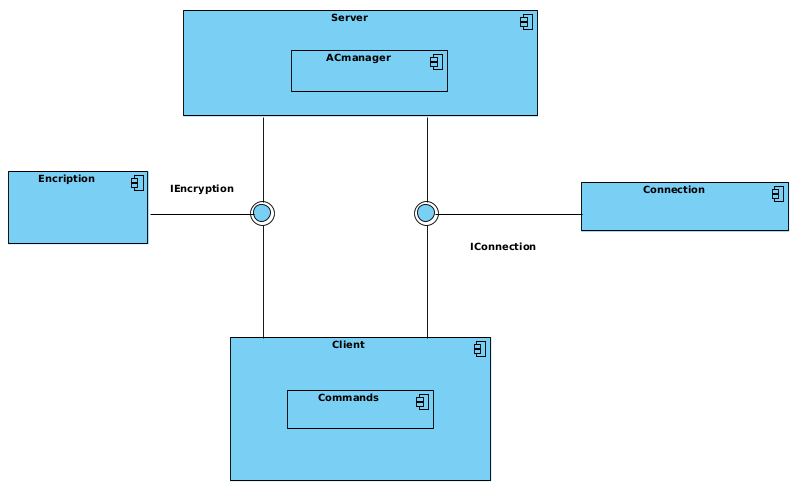
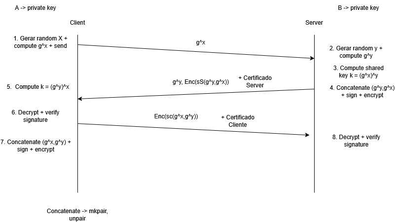

# Relatório do Projeto de Segurança de Sistemas Informáticos

## Introdução

Este relatório descreve a implementação de um serviço de Cofre Seguro que permite aos membros de uma organização armazenarem e partilharem ficheiros de texto com garantias de **autenticidade**, **integridade** e **confidencialidade**. O serviço é composto por um servidor que mantém o estado da aplicação e uma aplicações cliente para interação do utilizador com o sistema.

## Arquitetura de Segurança

A nossa arquitetura de segurança do sistema baseia-se em:

- _Autenticação mútua_ utilizando certificados X.509

- _Estabelecimento de chaves seguras_ utilizando o protocolo Station-to-Station (STS)

- _Confidencialidade_ através de criptografia simétrica AES-GCM

- _Integridade_ garantida por assinaturas digitais

- _Proteção contra ataques man-in-the-middle_ utilizando certificados e autenticação mútua.



## Certificados e Keystores

O sistema utiliza ficheiros PKCS12 (.p12) como keystores para armazenar o **certificado do utilizador**, **chave privada do utilizador** e **certificado de autoridade de certificação** (CA).

Estes ficheiros são organizados da seguinte forma na pasta projCA:

- VAULT_CA.crt - Certificado da CA raiz (auto-assinado)
- VAULT_CLIx.p12 - Keystore do cliente x (contendo certificado e chave privada)
- VAULT_CLIx.crt - Certificado do cliente x
- VAULT_CLIx.key - Chave privada do cliente x
- VAULT_SERVER.p12 - Keystore do servidor
- VAULT_SERVER.crt - Certificado do servidor
- VAULT_SERVER.key - Chave privada do servidor

## Protocolo de Handshake Seguro (Station-to-Station)

O handshake implementado segue o protocolo Station-to-Station (STS), uma variante do Diffie-Hellman com autenticação através de assinaturas digitais. Este protocolo garante autenticação mútua e estabelecimento de chaves entre cliente e servidor.



### Descrição das Etapas do Handshake:

1. Mensagem 1 (Cliente -> Servidor):
- O cliente gera um número aleatório X e calcula g^X (onde g é o gerador e p é um número primo grande).

- O cliente envia g^X ao servidor junto com o seu identificador (1,2 ou 3).

- Este valor público é enviado em formato PEM usando a biblioteca `criptography`.

2. Mensagem 2 (Servidor -> Cliente):

- O servidor gera um número aleatório Y e calcula g^Y.
- Calcula a chave partilhada k = (g^X)^Y.
- Concatena (g^Y, g^X) e assina esta concatenação com sua chave privada: S(g^Y, g^X).
- Cifra a assinatura usando AES-GCM com a chave partilhada derivada: Enc(S(g^Y, g^X)).
- Envia g^Y, a assinatura cifrada e seu certificado ao cliente.

3. Processamento no cliente (após receber mensagem 2):

- Calcula a chave partilhada k = (g^Y)^X.
- Decifra a assinatura cifrada do servidor.
- Verifica o certificado do servidor usando o certificado da CA.
- Verifica a assinatura usando a chave pública do servidor extraída do certificado.
- Se a verificação for bem-sucedida, prepara a próxima mensagem.

4. Mensagem 3 (Cliente -> Servidor):

- Concatena (g^X, g^Y) e assina esta concatenação com sua chave privada: S(g^X,g^Y).
- Cifra a assinatura usando AES-GCM com a chave partilhada derivada: Enc(S(g^X, g^Y)).
- Envia g^X, a assinatura cifrada e seu certificado ao servidor.

5. Processamento no Servidor (após receber mensagem 3):

- Decifra a assinatura cifrada do cliente.
- Verifica o certificado do cliente usando o certificado da CA.
- Extrai o pseudônimo (user_id) do certificado do cliente.
- Verifica a assinatura usando a chave pública do cliente extraída do certificado.
- Se a verificação for bem-sucedida, o handshake está completo.

Na implementação do cliente, o handshake é feito principalmente através do método `process()` da classe `Client`. Para o servidor, o handshake é implementado no método `process()` da classe `ServerWorker`.

## Gestão de Ficheiros Seguros

Após o handshake inicial e estabelecimento de canais seguros, o sistema implementa um mecanismo para gestão segura de ficheiros, incluindo operações como: `add`, `list`, `share`, `delete`, `replace`, `details`, `revoke`, `read`, `group create`, `group delete`, `group add-user`, `group delete-user`, `group list`, `group add` e `exit`.

## Implementação do Controlo de Acesso

O sistema de gestão de ficheiros é implementado através da classe ACmanager, que gere:

1. Ficheiros Pessoais:

- Armazenados na pasta específica de cada utilizador
- O proprietário tem permissões completas de leitura e escrita
- Podem ser partilhados com outros utilizadores com permissões específicas


2. Ficheiros Partilhados:

- Ficheiros pessoais partilhados com outros utilizadores
- As permissões (leitura/escrita) são definidas pelo proprietário
- O proprietário pode revogar o acesso a qualquer momento


3. Grupos:

- Coleções de utilizadores geridas por um proprietário
- Cada membro do grupo pode ter permissões diferentes
- Os ficheiros de grupo são armazenados em pastas específicas de grupo


## Estrutura de Dados
O sistema utiliza diversos ficheiros JSON para manter o estado da aplicação:

- `users.json`: Informações sobre utilizadores e seus ficheiros pessoais
- `groups.json`: Informações sobre grupos, membros e ficheiros de grupo
- `sharedFiles.json`: Registo de ficheiros partilhados entre utilizadores

### Troca de chaves RSA (Mensagem 3):

1. Cliente -> Servidor: 
- O cliente envia sua chave pública RSA cifrada com AES-GCM usando a chave partilhada derivada do handshake STS
- Esta chave será usada para operações de partilha segura de ficheiros.

2. Servidor -> Cliente:
- Confirma receção da chave RSA com uma mensagem também cifrada.


## Proteção Contra Ataques Man-in-the-Middle
A implementação protege contra ataques man-in-the-middle através de várias medidas de segurança:

- **Autenticação mútua com certificados X.509**:

Tanto o cliente quanto o servidor autenticam-se mutuamente usando certificados emitidos por uma CA confiável. Os certificados são verificados contra o certificado da CA (VAULT_CA.crt). A identidade de cada parte é confirmada através do campo no certificado.


- **Assinaturas digitais das chaves públicas trocadas**:

Cada parte assina a concatenação das chaves públicas Diffie-Hellman (g^X, g^Y). Isso garante que as chaves públicas não foram manipuladas durante a transmissão, logo um atacante não consegue substituir as chaves públicas sem ser detectado.


- **Derivação de chave com HKDF**:

A chave partilhada é derivada usando HKDF com SHA-256. Isso fortalece a chave resultante contra possíveis vulnerabilidades.


- **Cifra das assinaturas com AES-GCM**:

As assinaturas são cifradas com AES-GCM usando a chave partilhada AES-GCM fornece confidencialidade e integridade (autenticação). O uso de nonces aleatórios previne ataques de repetição.

## Estrutura da comunicação

A troca de mensagens em que envolve várias componentes cujos tamanhos não são fáceis de prever. Para isso, utilizámos as funções apresentadas abaixo, que incluem informação dos tamanhos na serialização de um par de bytestrings. A comunicação entre cliente e servidor é estruturada utilizando as funções `mkpair` e `unpair`, que permitem serializar e desserializar mensagens compostas. Estas funções facilitam a transmissão de múltiplos dados em uma única mensagem, como: chaves públicas DH, nonces para AES-GCM, assinaturas digitais cifradas e certificados X.509 Este formato de mensagem permite uma comunicação eficiente e segura entre as partes. 

```python
def mkpair(x, y):
    """produz uma byte-string contendo o tuplo '(x,y)' ('x' e 'y' são byte-strings)"""
    len_x = len(x)
    len_x_bytes = len_x.to_bytes(2, "little")
    return len_x_bytes + x + y

def unpair(xy):
    """extrai componentes de um par codificado com 'mkpair'"""
    len_x = int.from_bytes(xy[:2], "little")
    x = xy[2 : len_x + 2]
    y = xy[len_x + 2 :]
    return x, y
```

# Aspetos Criptográficos de Segurança

O sistema após o handshake utiliza criptografia simétrica e assimétrica para garantir confidencialidade, integridade e autenticidade nas comunicações e no armazenamento de dados.

**Operações Criptográficas do Cliente**

O cliente implementa várias operações criptográficas essenciais, sendo a função `encrypt_file` central para a segurança dos dados. Esta função opera através da geração de uma chave AES-128 aleatória para cada ficheiro, armazenando-a de forma segura no sistema de ficheiros local do cliente e cifrando o conteúdo do ficheiro usando AES-GCM com um nonce único de 12 bytes e autenticação de dados (GCM). Retorna o conteúdo cifrado (nonce + texto cifrado) e um comando de controle, garantindo que cada ficheiro tenha sua própria chave de cifra única, que o servidor nunca tenha acesso à chave em texto plano e que a integridade do ficheiro seja verificável através do GCM.

```python
    def encrypt_file(self, file_path: str, file_id: str) -> tuple:
        try:
            aes_key = os.urandom(16)
            aesgcm = AESGCM(aes_key)
            nonce = os.urandom(12)

            with open(f"VAULT_CLI{self.id}/{file_id}.key", 'wb') as k:
                k.write(aes_key)

            with open(file_path, 'rb') as f:
                file_content = f.read()

            ciphertext = aesgcm.encrypt(nonce,file_content, None)

            command_msg = f"file"

            encrypted_command = self.encrypt(command_msg)

            encrypted_data = nonce + ciphertext 

            return encrypted_data, encrypted_command 
        
        except Exception as e: 
            print(f"File encryption failed: {e}")
            return None, None

```

Para operações de substituição e partilha de ficheiros, o cliente implementa funções especiais como `encrypt_replaced_file`, que reutiliza a chave AES existente de um ficheiro para cifrar uma nova versão, e `encrypt_file_with_key`, que permite cifrar um ficheiro com uma chave AES específica fornecida. Estas funções mantêm a segurança ao garantir que ficheiros substituídos mantenham as mesmas permissões de acesso e permitir a partilha segura através de chaves específicas.

```python
    def encrypt_replaced_file(self, file_path: str, file_id: str) -> tuple:
        """
        Encripta um arquivo usando uma chave AES existente (file_id.key)
        
        Args:
            file_path: Caminho do arquivo a ser encriptado
            file_id: ID do arquivo para buscar a chave existente
            
        Returns:
            tuple: (encrypted_data, encrypted_command) ou (None, None) em caso de erro
        """
        try:
            # 1. Buscar a chave existente
            key_path = f"VAULT_CLI{self.id}/{file_id}.key"
            if not os.path.exists(key_path):
                print(f"Chave não encontrada para file_id: {file_id}")
                return None, None
            
            print("antes do open")

            with open(key_path, 'rb') as k:
                aes_key = k.read()
                

            # 2. Inicializar AES-GCM
            aesgcm = AESGCM(aes_key)
            nonce = os.urandom(12)  # Novo nonce para cada encriptação

            print("nonce")
            # 3. Ler e encriptar o arquivo
            with open(file_path, 'rb') as f:
                file_content = f.read()

            ciphertext = aesgcm.encrypt(nonce, file_content, None)

            # 4. Preparar comando
            command_msg = "file"
            encrypted_command = self.encrypt(command_msg)

            # 5. Concatenar nonce + ciphertext
            encrypted_data = nonce + ciphertext

            print("alo")

            return encrypted_data, encrypted_command
            
        except Exception as e:
            print(f"Falha ao encriptar arquivo substituído: {e}")
            return None, None
```

```python
    def encrypt_file_with_key(self, file_path: str, aes_key: bytes) -> tuple:
        """
        Encripta um arquivo usando uma chave AES específica
        
        Args:
            file_path: Caminho do arquivo a ser encriptado
            aes_key: Chave AES (16 bytes para AES-128)
            
        Returns:
            tuple: (nonce + ciphertext, encrypted_command) ou (None, None) em caso de erro
        """
        try:
            # Verifica se a chave tem tamanho correto
            if len(aes_key) != 16:
                raise ValueError("Chave AES deve ter 16 bytes (AES-128)")
                
            # Inicializa AES-GCM
            aesgcm = AESGCM(aes_key)
            nonce = os.urandom(12)  # Nonce único para cada encriptação

            # Lê e encripta o arquivo
            with open(file_path, 'rb') as f:
                file_content = f.read()

            ciphertext = aesgcm.encrypt(nonce, file_content, None)

            # Prepara comando (opcional, conforme sua implementação)
            command_msg = "file"
            encrypted_command = self.encrypt(command_msg)

            return (nonce + ciphertext), encrypted_command
            
        except Exception as e:
            print(f"Falha na encriptação com chave: {e}")
            return None, None
```

Na partilha segura de ficheiros, o cliente implementa a cifragem de chaves AES com RSA-OAEP, usando a chave pública do destinatário com padding OAEP e SHA-256 para segurança máxima, seguida de codificação Base64 para transmissão segura. O cliente também possui capacidade para decifrar ficheiros de três origens diferentes: ficheiros próprios (usando chave local), ficheiros partilhados (decifrando primeiro a chave AES com RSA) e ficheiros de grupo (combinando ambos os métodos conforme necessário).

**Fluxo de Operações Seguras**

No processo de adição de ficheiros, o cliente gera chave AES e cifra o ficheiro localmente, enviando apenas o conteúdo cifrado para o servidor enquanto armazena a chave AES localmente de forma segura. Para partilha de ficheiros, o cliente solicita a chave pública do destinatário ao servidor, cifra a chave AES do ficheiro com essa chave pública e envia a chave cifrada para armazenamento no servidor.

Na leitura de ficheiros, o cliente utiliza chave local para ficheiros próprios. Para ficheiros partilhados, recebe a chave AES cifrada do servidor, decifra-a com sua chave privada RSA e então decifra o conteúdo do ficheiro com a chave AES. Na gestão de grupos, cifra o ficheiro uma vez com chave AES única e depois cifra essa chave AES para cada membro do grupo com suas chaves públicas, armazenando todas as versões cifradas no servidor.

**Segurança de Dados em Repouso**

O cliente armazena localmente as chaves AES para seus ficheiros (em `VAULT_CLI{user_id}/`), seu par de chaves RSA (em `projCA/`) e certificado digital assinado pela CA, garantindo a proteção dos dados quando não estão em transmissão.

**Conclusão**

O sistema implementado oferece confidencialidade através de cifra AES-GCM para ficheiros e comunicações, integridade verificada por HMAC no GCM e assinaturas digitais, autenticidade garantida por certificados digitais e STS, não-repúdio provido por assinaturas digitais nas operações críticas e controle de acessos implementado via partilha seletiva de chaves. A separação de responsabilidades entre cliente e servidor garante que o servidor nunca acessa dados em texto plano, que o cliente mantém controle sobre quem pode acessar seus dados e que as chaves são protegidas durante todo o ciclo de vida.

